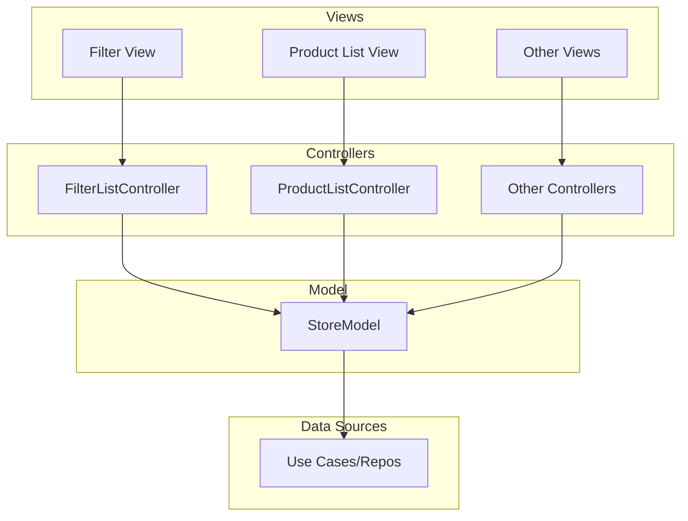

### MVC Architecture for Android Application

This diagram illustrates the architecture of the application, based on the **Smalltalk-80 MVC** principles, adapted for modern Android development using **StateFlow** and **SharedFlow** for reactive state management. Our implementation strives to adhere closely to the original MVC pattern as described in the Smalltalk-80 documentation.

#### **Diagram**

#### **Explanation**

1. **Views**:
    - Responsible for rendering UI elements and displaying data to the user.
    - Observes state from the **StoreModel** (via `StateFlow`) for updates.

2. **Controllers**:
    - Handle user input and delegate actions to the **StoreModel**.
    - Controllers are stateless and act as mediators between the view and the model.

3. **Model**:
    - Encapsulates application state and business logic.
    - Exposes reactive state (`StateFlow`) and events (`SharedFlow`) for views and controllers to consume.
    - Delegates complex data operations to **use cases** or **repositories**.

4. **Reactive Flow**:
    - **State Updates**: Views automatically update by observing state from the model.
    - **Event Handling**: Controllers pass user actions to the model, which emits events or updates state accordingly.

#### **Key Features**
- **Reactive State Management**: Powered by `StateFlow` and `SharedFlow`.
- **Separation of Concerns**: Clear responsibilities for views, controllers, and the model.
- **Modern Adaptation**: Based on Smalltalk-80 MVC principles, adapted for Android's reactive ecosystem.
- **Original Inspiration**: This implementation is heavily inspired by the original Smalltalk-80 MVC architecture, maintaining its emphasis on modularity and the observer pattern while integrating modern reactive tools.
